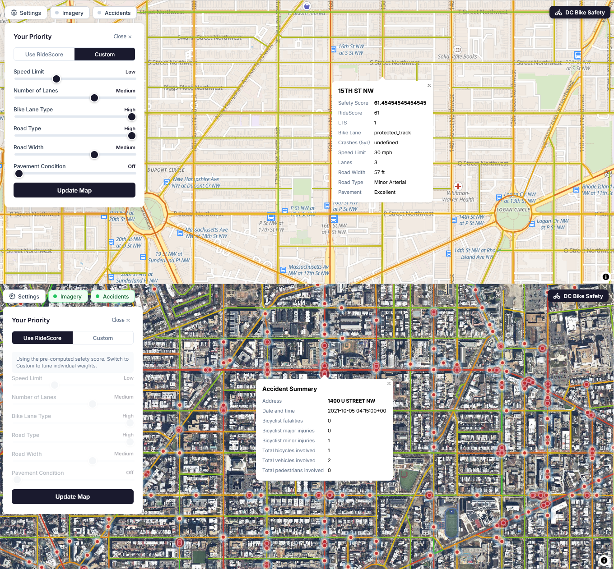

# RideScore DC — models

This repository holds the **data processing and safety scoring** behind the
interactive DC bike safety map. It pulls
[road](https://opendata.dc.gov/datasets/DCGIS::roadway-block/about) and
[crash](https://opendata.dc.gov/datasets/crashes-in-dc/about) data from the Open
Data DC portal, turns them into safety factors and a RideScore, and loads the
result into the PostGIS database the map serves from. You can explore the map
[here](http://161.35.142.176/).



---

## Three ways to work here

Contributions come in three levels, each demanding more than the last. **Start
at level 1.** You do not need to reach level 3 for your work to matter — most
good ideas are proven and discussed long before anything touches production.

| | You are doing | You need | Guide |
|---|---|---|---|
| **1** | Modelling in notebooks | Python | [getting-started-as-a-modeler.md](docs/getting-started-as-a-modeler.md) |
| **2** | Showing it on a map | Docker | [demonstrating-your-model.md](docs/demonstrating-your-model.md) |
| **3** | Running it as a pipeline | Kestra, group approval | [ongoing-data-pipeline.md](docs/ongoing-data-pipeline.md) |

---

### Level 1 — Model the data in a notebook

**For beginners, especially anyone in a data science role.** This is where the
actual thinking happens. Everything is tables and dataframes — no maps, no
database, no containers. You are working out the key computations of a safety
model and showing they hold up.

Start here:

1. Read **[docs/getting-started-as-a-modeler.md](docs/getting-started-as-a-modeler.md)**.
2. Look through **[`notebooks/`](notebooks/)** — that folder is for you. Every
   model in the project lives there, one folder each.
3. **Say hello on the `#ridescore-dc` channel in the CivicTechDC Slack.**
   Ideally before you start, so you hear about related work and nobody
   duplicates your effort — but at the very least when you open your proposal.
4. Start from **[`notebooks/model-template.ipynb`](notebooks/model-template.ipynb)**,
   or copy a similar existing model and work from that.

Then open a pull request into this repository adding **a new folder under
`notebooks/` with your model inside it.** Give the folder a good, descriptive
name — it is how people will refer to your model from then on.

All work goes on a feature branch, never straight onto `develop`:

```bash
git checkout -b feature/new-model-name-here
```

---

### Level 2 — Show it on a map

Once a model computes something interesting, the next question is always *what
does it look like?* Level 2 answers that end to end on your own machine, and
demonstrates how the model **would** behave on the staging server if the group
adopts it.

1. Get the full stack running locally with Docker by following the developer
   spinup guide in the
   **[ridescoredc-website](https://github.com/civictechdc/ridescoredc-website)**
   repository — that repo owns the containers, so follow its guide rather than
   any copy of it.
2. Load your model's output into that local Postgres database.
3. Modify the frontend `index.html` to render *your* scores instead of the
   published ones.

You will end up changing both the database and the frontend, which is the
point: it shows the whole path a proposal would have to travel.

Details and the exact steps are in
**[docs/demonstrating-your-model.md](docs/demonstrating-your-model.md)**.

---

### Level 3 — Make it an ongoing data pipeline

**Only after the group has approved a model.** If a model has traction and is
going to be maintained rather than demonstrated once, it needs to run on a
schedule, from version-controlled definitions, into the production database.
That is what [`kestra/`](kestra/) is for.

Start with **[docs/ongoing-data-pipeline.md](docs/ongoing-data-pipeline.md)**.

---

## Repository layout

```
notebooks/              level 1 — one folder per model, plus the template
  BaseData/               the shared road network every model starts from
  LTS/ RideScore/ BNA/ Bikeability/
tools/ridescore-cli/    the one implementation: `ridescore` CLI + library
kestra/                 level 3 — flow definitions, authoritative for the pipeline
schema/                 database schema, migrations, and the tile function
docs/                   the three guides above
```

The single most important rule: **`tools/ridescore-cli/` is the only
implementation of the published model.** Notebooks, your laptop, and Kestra are
three different *runners* over that one package. A model that exists only in a
notebook will drift from what the map serves.

---

## The safety score

The road data are simplified and cleaned up (see the notebooks for details). For
crashes, we use only those that resulted in a bicyclist fatality or injury in the
last five years.

### Level of traffic stress

We use our own modified LTS calculator, 1 (calm) to 4 (hostile):

<table>
  <tbody>
    <tr>
      <th>Bike lane</th>
      <th>Number of lanes</th>
      <th>Speed limit</th>
      <th>Road function</th>
      <th>LTS</th>
    </tr>
    <tr style="background-color: #a4f1b6;">
      <td>Protected track</td>
      <td>-</td>
      <td>-</td>
      <td>-</td>
      <td>1</td>
    <tr style="background-color: #f7f08c;">
      <td>Buffered lane or painted lane</td>
      <td>&lt;= 2</td>
      <td>&lt;= 25</td>
      <td>-</td>
      <td>2</td>
    </tr>
    <tr style="background-color: #f7f08c;">
      <td>None</td>
      <td>&lt;= 2</td>
      <td>&lt;= 25</td>
      <td>Local</td>
      <td>2</td>
    </tr>
    <tr style="background-color: #f0c77b;">
      <td>Buffered lane or painted lane</td>
      <td>&gt;2 and &lt;=3</td>
      <td>&gt;25 and &lt;= 30</td>
      <td>-</td>
      <td>3</td>
    </tr>
    <tr style="background-color: #f0c77b;">
      <td>None</td>
      <td>&lt;=2</td>
      <td>&gt;25 and &lt;= 30</td>
      <td>Local</td>
      <td>3</td>
    </tr>
    <tr style="background-color: #e47d86;">
      <td colspan="4">Any other combination</td>
      <td>4</td>
    </tr>
  </tbody>
</table>

> **Known discrepancy.** This table documents the no-facility local-street rule
> as ≤ 25 mph; the implemented rule is ≤ 20 mph. The code is the current
> behaviour — see `LTS_NO_FACILITY_SPEED_2` in
> [config.py](tools/ridescore-cli/src/ridescore/config.py) for why it has not
> been silently "fixed".

### RideScore v1

The published score has three components:

1. **LTS**, mapped `{1: 100, 2: 75, 3: 40, 4: 10, missing: 10}`
2. **Bike lane type**, mapped `{protected_track: 10, buffered_lane: 5, painted_lane: 3, none: 0}`
3. **Crashes**, normalised as `100 × (1 − crashes / 95th percentile of crashes)`

Combined as `LTS×0.6 + Crash×0.3 + bike_lane×0.1`.

Users of the map can also build their own score by re-weighting speed limit,
number of lanes, bike lane type, road type, road width, and pavement condition.
Those weights are applied at tile-render time by the `update_score` PostGIS
function, which lives in [`schema/`](schema/).

---

## Related repos

- [ridescoredc](https://github.com/civictechdc/ridescoredc) — parent repo and project overview
- [ridescoredc-website](https://github.com/civictechdc/ridescoredc-website) — serves the interactive map and survey tool from the database this pipeline produces
